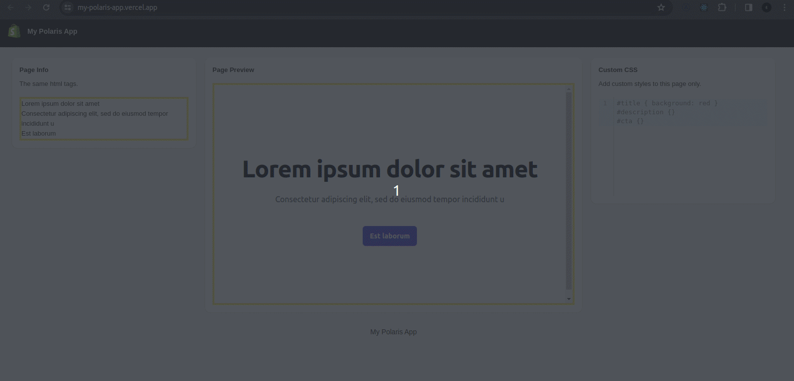
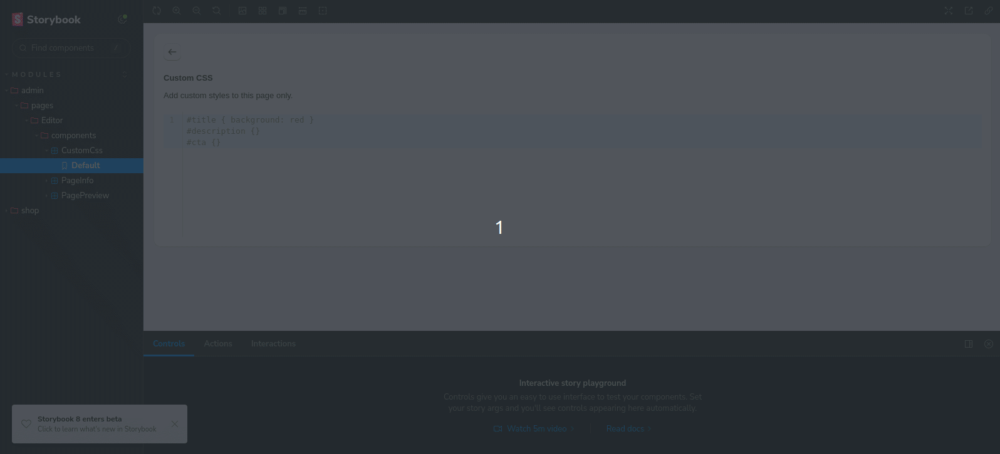
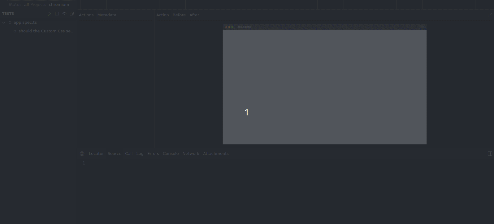

# My Polaris App

This is a Next.js project bootstrapped with create-next-app.

### [Demo](https://my-polaris-app.vercel.app/)



## Requirements

> Note: This project contains the configuration for [devcontainer](https://code.visualstudio.com/docs/devcontainers/containers).

- NodeJS v20
- [PNPM](https://pnpm.io/) v8.11.0
- Docker (Devcontainer only)

## Installation

#### 1. Install dependencies with pnpm

```bash
pnpm install
```

#### 2. Run the project

Run with pnpm and open `http://localhost:3000` in your browser.

```bash
pnpm run dev
```

## Other Available Scripts

Builds the app for production to the `build` folder.

```bash
pnpm run build
```

Run with pnpm and open `http://localhost:3000` in your browser for production mode.

```bash
pnpm run start
```

Format your code with Prettier.

```bash
pnpm run format
```

Develop, test and document components with Storybook.

```bash
pnpm run storybook
```



Visual testing with Playwright.

> Note: Probably you need to install playwrigth dependencies before run your tests. `pnpm exec playwright install --with-deps`

```bash
pnpm run test:e2e
```

```bash
pnpm run test:e2e --ui #Show UI
```



## References

- [NodeJS](https://nodejs.org/en)
- [PNpM - Fast, disk space efficient package manager](https://pnpm.io/)
- [Next.js - The React Framework for the Web](https://nextjs.org/)
- [Shopify Polaris](https://polaris.shopify.com/)
- [Tailwind CSS - Rapidly build modern websites without ever leaving your HTML.](https://tailwindcss.com/)
- [Storybook: UI component explorer for frontend developers](https://storybook.js.org/)
- [Playwright: Enables reliable end-to-end testing for modern web apps](https://playwright.dev/)
- [Development Containers](https://containers.dev/)
- [Husky- Modern native git hooks made easy](https://typicode.github.io/husky/)
- [Github Actions - Automate your workflow from idea to production](https://github.com/features/actions)
- [Conventional Commits - A specification for adding human and machine readable meaning to commit messages](https://www.conventionalcommits.org/en/v1.0.0/)
- [React CodeMirror - CodeMirror component for React.](https://uiwjs.github.io/react-codemirror/)
